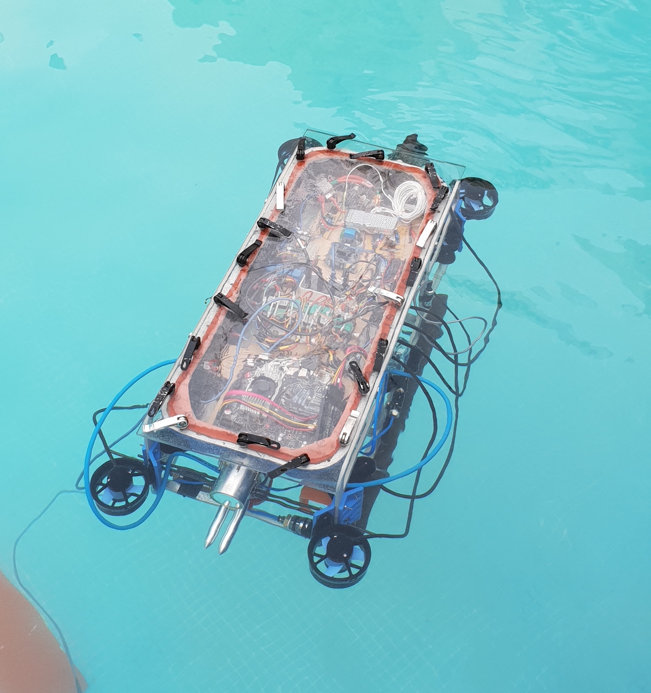
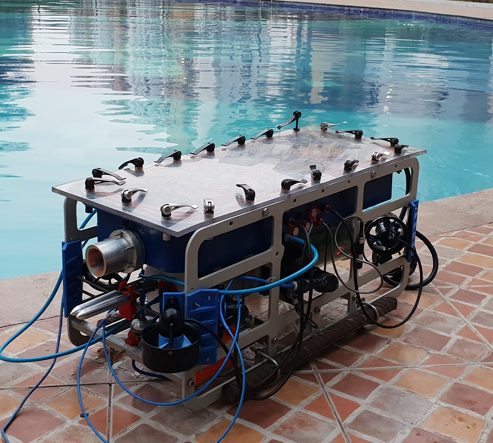
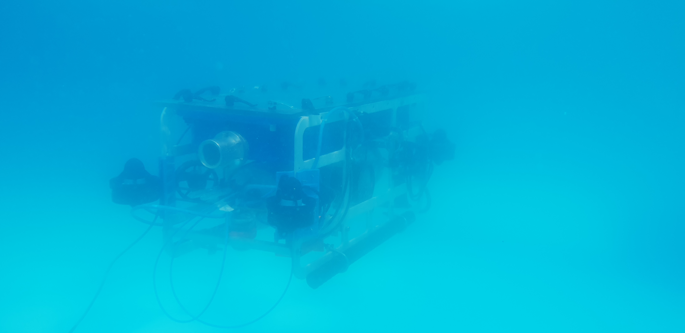
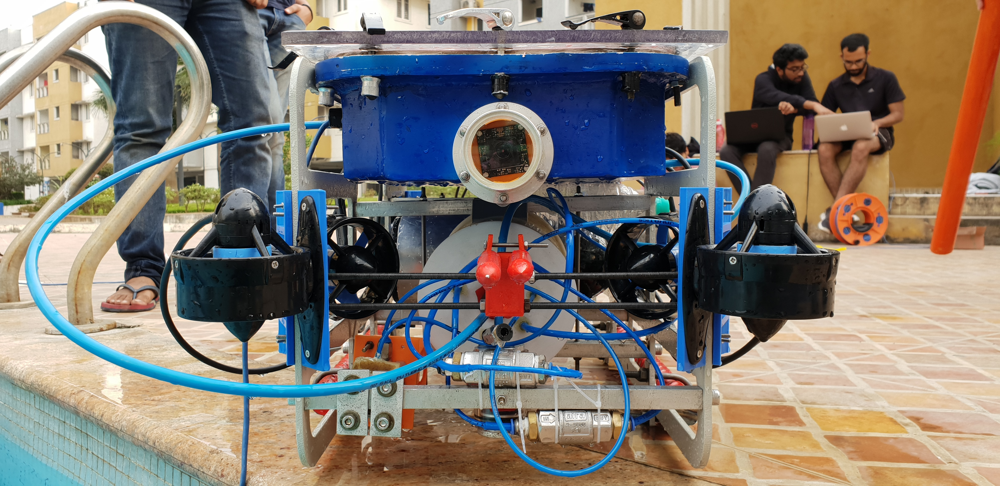

# ZARNA

> SRM Autonomous Underwater Vehicle Code.

<p align='center'>
  
  
  
  
  
</p>

### About:
This repository contains the code used by the software team of SRM Autonomous Underwater Vehicle (SRMAUV). Our website is [teamsrmauv.com](http://teamsrmauv.com).

### Prerequisites:

- Ubuntu 16.04
- [ROS Kinetic Kame](http://wiki.ros.org/kinetic#Installation)

### Installation:
```bash
git clone https://github.com/srmauvsoftware/srmauv
cd srmauv
catkin_make
```

### Additonal dependencies:

```bash
sudo apt-get install ros-kinetic-video-stream-opencv 
sudo apt-get install ros-indigo-rosserial-arduino    
sudo apt-get install ros-indigo-rosserial    
sudo apt-get install ros-kinetic-pid    
```
